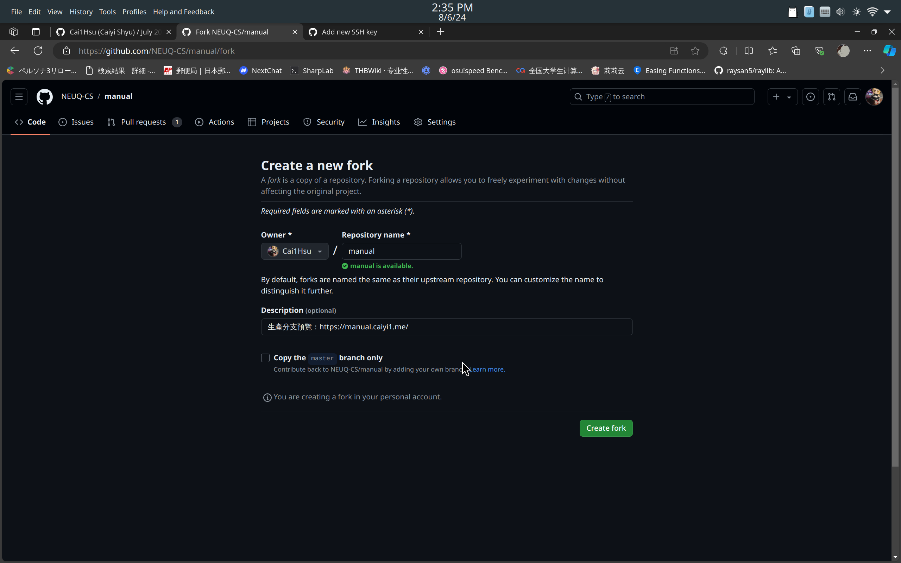
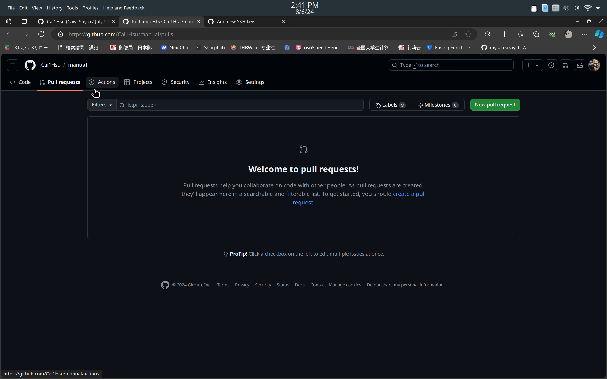
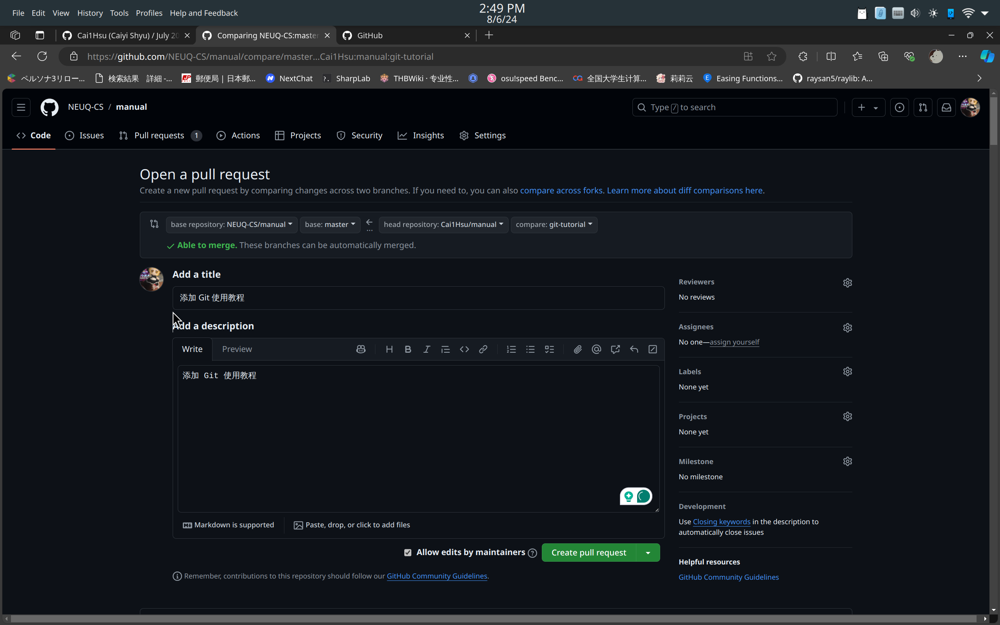

要使用 GitHub 托管你的代码，你需要一个 GitHub 账号。这部分不再赘述，你可以自行注册。本文假设你已经注册了 GitHub 账号。

GitHub 以 Git 为基础，它本质上托管了一个个 Git 仓库。为了能够用 Git 访问 GitHub 上的仓库，你需要配置 SSH 密钥。在前面的教程中，我们已经为自己生成了 SSH 密钥，现在我们要将这个密钥添加到 GitHub 上。

## 添加 SSH 密钥

添加 SSH 密钥是将你的密钥对的公钥添加到 GitHub 上，这样 GitHub 就能够识别你的操作是不是由你的私钥发出的。

所以现在先来获取你的公钥。

生成的密钥对默认在`~/.ssh/`文件夹下，先查看一下：

```bash
cd ~/.ssh && ls
```

根据你使用的加密算法，你会看到`id_rsa`和`id_rsa.pub`或者`id_ed25519`和`id_ed25519.pub`。`.pub`后缀的文件就是你的公钥。

```
caiyi@archlinux ~/t/manual (a)> cd ~/.ssh/ && ls
id_ed25519.pub  id_rsa.pub   known_hosts.old
id_ed25519   id_rsa          known_hosts
```

选择你的公钥文件，打开它，复制里面的内容。

如果不巧的是，你同时生成了多对密钥，那么你需要找到 Git 使用的是哪一个密钥。或者保险一点，你可以将所有的公钥都添加到 GitHub 上。

复制完内容以后，在浏览器中打开 [https://github.com/settings/keys](https://github.com/settings/keys)，点击右侧绿色的`New SSH key`。

在 Title 中填写一个用于标识这个密钥的名字，比如`My ArchLinux Laptop`。确保`key type`是`Authentication key`，在 Key 中粘贴你的公钥内容。你的公钥内容应该以你的邮箱结尾，如果不是，要么你复制成了私钥，要么你没有复制完整。

填写完成后，点击`Add SSH key`，GitHub 可能会通过各种方式认证你的操作，比如输入密码，输入验证码等等。完成后，你的公钥就添加到了 GitHub 上。

## 验证 SSH 密钥

通过以下命令验证你的 SSH 密钥是否添加成功：

```bash
ssh -T git@github.com
```

如果提示是否使用 SSH 密钥，请直接回车（同意）。然后你应该会看到类似于以下的输出。

```
Hi <你的用户名>! You've successfully authenticated, but GitHub does not provide shell access.
```

如果你看到了这个输出，那么你的 SSH 密钥就和你的 GitHub 账号绑定成功了。

## GitHub 工作流

关于拉取，推送远程仓库的操作，我们在[使用 Git](../use-git/get-started-with-gh.md)中已经讲过，这里不再赘述。将你的代码推送并保存在 GitHub 上，就是使用 GitHub 托管代码。

这里我们要讲的是如何使用 GitHub 进行协同开发，以及对其他项目作出的贡献。

使用 GitHub 进行协同开发，主要分为以下步骤：
1. 克隆远程仓库
2. 检出到语义分支
3. 编写代码
4. 提交并推送语义分支到远程仓库
5. 发起 Pull Request
6. 仓库维护者审查代码
7. 根据反馈修改代码(Optional)
8. 合并 Pull Request

### Pull Request

Pull Request 是你请求将一个分支合并到另一个分支的操作。在 GitHub 上，Pull Request 通常用于请求将你的代码合并到主分支。在这个过程中，仓库的维护者会对你的代码进行审查（review），提出修改意见，最终决定是否合并。

在开启 Pull Request 的过程中，继续对代码进行修改是很常见的。你可以在提交 PR 的分支中继续提交代码，这样审查者就可以看到你的修改。审查者也可以在 Pull Request 中提出修改意见，你可以根据意见进行修改。

发起 Pull Request 可以在同一个仓库间发起，也可以在 Forks 间发起，Fork和源仓库间发起。稍后我会介绍 Fork。

### Fork

上述的协同开发的步骤适用于你具有直接读写权限的仓库，即你自己的仓库或者你所在组织的仓库。

对于你不直接具有写入权限的仓库，你需要 Fork 这个仓库。Fork 是 GitHub 提供的一个功能，它可以将一个仓库复制到你的账号下，你可以对这个仓库进行任意操作，包括修改，删除等。

Fork 一个仓库后，你可以在你的 Fork 中创建分支，修改代码，提交代码，发起 Pull Request。Fork 仓库的 Pull Request 可以发到源仓库中，当源仓库的维护者接受你的 Pull Request 后，你的代码就会合并到源仓库中。

使用 GitHub 对其他项目作出贡献的步骤基本于上述步骤相同，只是你需要 Fork 这个仓库，然后在 Fork 中进行操作，步骤如下：

1. Fork 仓库
2. 克隆 Fork 仓库到本地
3. 检出到语义分支
4. 编写代码
5. 提交并推送语义分支到 Fork 仓库
6. 发起 Pull Request
7. 仓库维护者审查代码
8. 根据反馈修改代码(Optional)
9. 合并 Pull Request

## GitHub 相关操作

上述对 Pull Request 和 Fork 简单介绍，希望你能够理解这两个概念，下面让我们来实际操作一下。

假设我们要对本手册的仓库作出贡献，请先来到本仓库主页[https://github.com/NEUQ-CS/manual](https://github.com/NEUQ-CS/manual)。

点击右上角的`Fork`，来到 fork 界面。



请**务必确保取消**勾选`Copy the master branch only`，然后点击`Create fork`。

等待操作完成后，你就来到了你的 Fork 仓库。

现在，把这个仓库检出到本地：

```bash
git clone https://github.com/<你的用户名>/manual.git
```

然后进入本地仓库。

接着，请一定创建一个语义分支，不要在`master`分支上进行修改。语义分支意味着这个分支上的更改有一个明确的目的，比如`fix-typo`，`add-new-section`等。我现在在为本仓库编写使用 Git 的教程，所以我创建了一个`git-tutorial`分支。

```bash
git checkout -b git-tutorial
```

接着，我们在`src`目录下编写一个新的教程，比如`use-github.md`。

编写完成后，用前面教你的方法commit，然后推送到你的 Fork 仓库。

```bash
# 添加更改到暂存区
git add src/use-github.md
# 提交更改
git commit -m "Add use-github.md"
# 推送到 Fork 仓库
git push origin git-tutorial
```

这样，远程的 fork 仓库就会多出一个`git-tutorial`分支，里面有你的更改。

接下来让我们对源仓库发起 Pull Request。

请来到fork仓库或者源仓库的 Pull Request 页面，点击右上角的`New Pull Request`。



接下来你会来到这个页面：


请确保
`base reposiory`是希望接受你的 PR 的仓库
`base`是接受你的 PR 的分支

`head repository`是你自己的 Fork 仓库
`compare`是你的分支。

在我们的例子中，
`base repository`是`NEUQ-CS/manual`
`base`是`master`
`head repository`是`<你的用户名>/manual`
`compare`是`git-tutorial`

选择正确后，你会看到你的更改的 diff，确保你的更改是正确的。


确认完毕后，就可以点击`Create Pull Request`。



在这个页面，请填写一个简短的标题和描述，描述你的更改的目的，内容等。

确保你勾选了`Allow edits from maintainers`，这样仓库维护者可以直接修改你的 PR。

然后点击`Create Pull Request`，就可以发起 Pull Request 了。

现在你需要做的就是等待仓库维护者审查你的代码，提出修改意见，最终合并你的 PR。

通常来说，良好的代码风格，清晰的描述，以及正确的更改是被接受的。

需要注意的是，在打开 Pull Request 后，请尽量不要强制推送到你的分支，这样会导致 PR 的状态不正确。大部分仓库的维护者都会反对强制推送。

合并 Pull Request 本质是合并两个分支，因此合并 PR 也可能出现合并冲突。如果出现合并冲突，你需要解决冲突。

关于冲突，我们会在下一讲中详细讲解。

## 总结

本文介绍了如何使用 GitHub 进行协同开发，以及对其他项目作出贡献。我们讲解了 Fork 和 Pull Request 的概念，以及如何操作。

希望你能够通过这篇文章了解 GitHub 的基本操作，以及如何使用 GitHub 对其他项目作出贡献。
