# VScode

`Visual Studio Code` 是由微软开发的一款轻量级代码编辑器。

下面以 VScode 配置 C++ 为例，来介绍 VScode 的安装和使用。

## 安装

### Windows

#### 手动安装

前往 [Visual Studio Code 官网](https://git-scm.com/download/windows)。你应该会看到和下图类似的页面：


单击 `Download for Windows` 即可跳转到下载页面开始安装包的下载：


下载完成后，双击安装包即可运行安装程序。

在此笔者强烈建议在 `选择附加任务` 页面勾选以下选项：


这样便于快速用 VScode 打开文件。

#### 使用包管理器

如果你有使用包管理器，可以使用包管理器来安装 VScode。  

例如，使用包管理器 winget 来安装 VScode，只需要运行以下命令:

```bash
winget install "Visual Studio Code"
```

### Mac

前往 [Visual Studio Code 下载页面](https://code.visualstudio.com/Download)，你应该会看到与下图类似的页面：

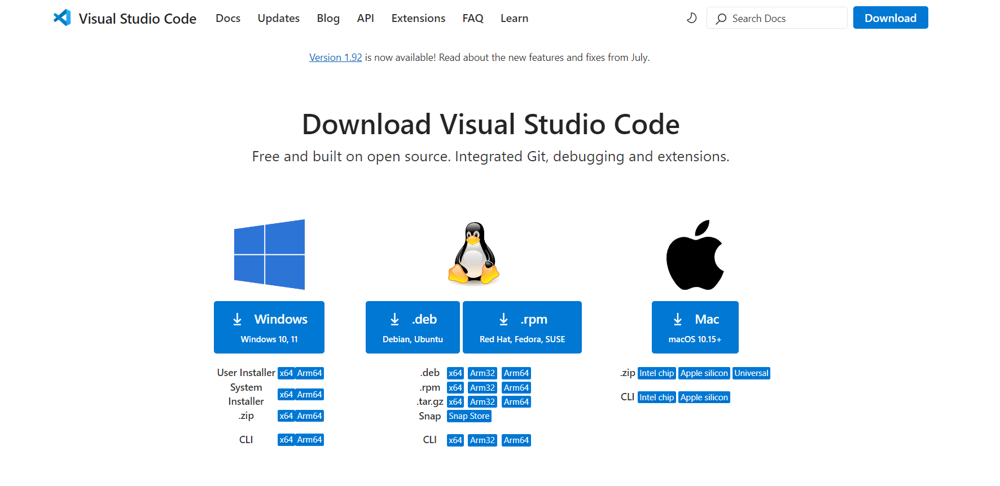

下载 Mac 版本后，得到的是一个 `.zip` 格式的压缩包，双击即可自动解压到本地目录中：


上图红框标出的就是解压得到的应用程序。

### Linux

跳转到你的发行版的部分，按照你的发行版安装即可。

如果包管理器没有对应的软件源，可以在 [Visual Studio Code 下载页面](https://code.visualstudio.com/Download) 下载对应发行版的软件包，  
将以下命令中的 `code` 替换成软件包的文件路径后再运行命令即可。

#### Arch Linux

```bash
sudo pacman -S code
```

#### Debian/Ubuntu

```bash
sudo apt install code
```

#### Fedora

```bash
sudo dnf install code
```

#### openSUSE

```bash
sudo zypper install code
```

## 安装插件

第一次打开 VScode，映入眼帘的应该是与下图类似的页面：


此时 vscode 的语言为英语。为了切换语言为中文，点击左侧的 ，进入插件商店：

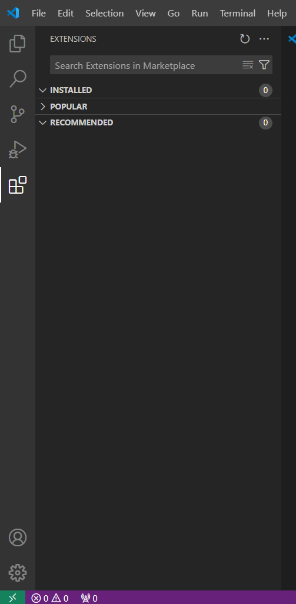

在搜索框中搜索 `chinese`，搜索结果的第一个就是 vscode 的简体中文插件：

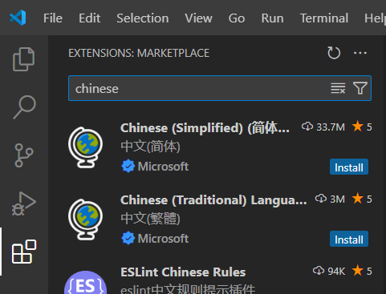

单击 `Install` 即可安装中文插件，进而切换语言为简体中文。

到此你应该已经学会了给 vscode 安装插件了。  
插件是 vscode 的核心之一。同样地，若要给 vscode 配置相关的编程语言，我们也往往需要安装相应的插件。  
例如，若要配置 c++，我们需要安装微软的 `C/C++` 插件（下图第一个）  
或者 `C/C++ Extension Pack` 插件包（下图第三个）：

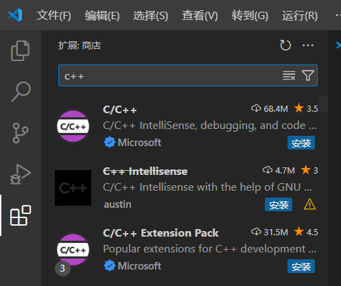

## 安装编译器

由 C++、Python 这样的高级语言编写的代码是不能被计算机直接执行的，  
这是因为计算机只认识由 0 和 1 表示的二进制机器指令。

如果要执行它们，要采取以下两种方式中的一种：

- 将高级语言编写的代码整体翻译成机器指令，即 **编译**（如 C++）。
- 将高级语言逐句翻译为机器指令，即 **解释**（如 Python）。

vscode 只是一个代码编辑器，它不具备编译或解释高级语言代码的功能。  
为了编译 C++ 代码，我们需要额外安装编译器。

### Linux

linux 系统下，最常用的 C/C++ 编译器毫无疑问是 `GCC`（GNU 编译器套件，GNU Complier Collection），  
此处我们安装的是套件里的 C++ 编译器 `g++`。

跳转到你的发行版的部分，按照你的发行版安装即可。

#### Arch Linux

```bash
sudo pacman -S g++
```

#### Debian/Ubuntu

```bash
sudo apt install g++
```

#### Fedora

```bash
sudo dnf install g++
```

#### openSUSE

```bash
sudo zypper install g++
```

### Mac

macOS 已经自带了苹果的 C/C++ 编译器 `clang`，且命令 `g++` 被重定向到了 `clang++`，  
二者的命令参数大多是共享的。你可以像在 linux 下使用 GCC 一样使用 clang。


### Windows

和 linux 一样，Windows 下也是可以使用 `GCC` 编译器的。但与 linux 下不同的是，  
它被集成到了 `MinGW`（Minimalist GNU for Windows）中。

原版 MinGW 只支持在 32 位系统中生成 32 位程序。  
此处我们要安装的是 `MinGW` 的 64 位扩展版本 `MinGW-w64`，其同时支持 32 位和 64 位系统。

打开 [MinGW-w64 官网](https://www.mingw-w64.org/) 的 [下载页面](https://github.com/niXman/mingw-builds-binaries/releases)，如下图所示：


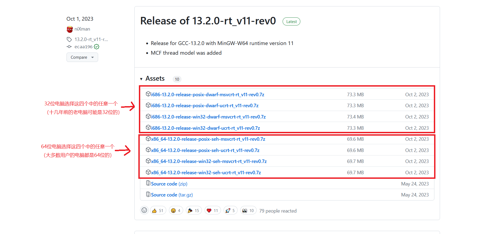

解压下载下来的压缩包后，将解压得到的文件夹放到一个合适的位置，  
然后打开里面的子文件夹 `bin`，就能找到 `g++.exe`：

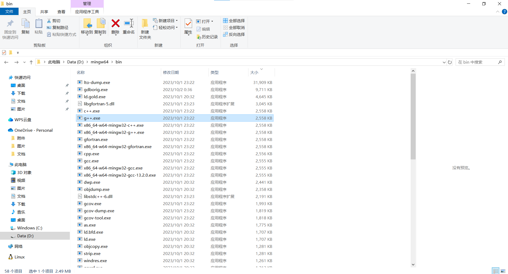

你可以直接在命令行下使用 `g++.exe` 完成编译。但为了适配 vscode，我们还需要配置环境变量。

右击 `此电脑`，单击 `属性`，然后点击 `高级系统设置`，再点击 `环境变量`：

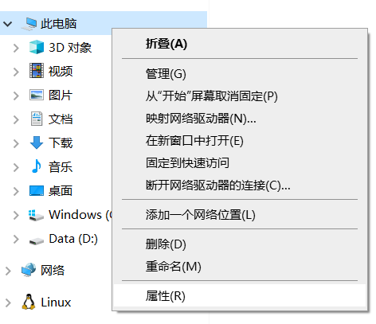

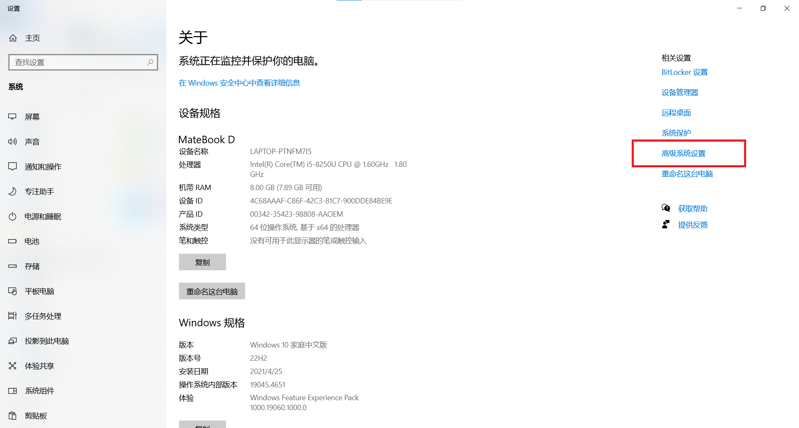


双击系统变量 `Path`，然后把 MinGW-w64 的 `bin` 文件夹的路径加进去：

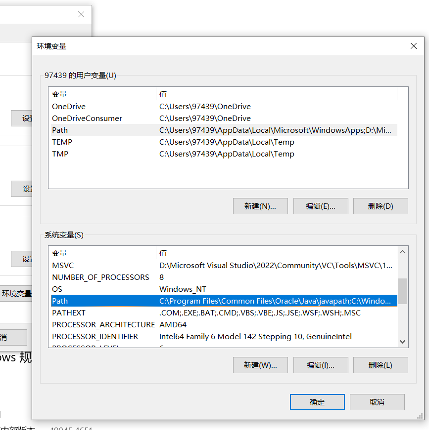

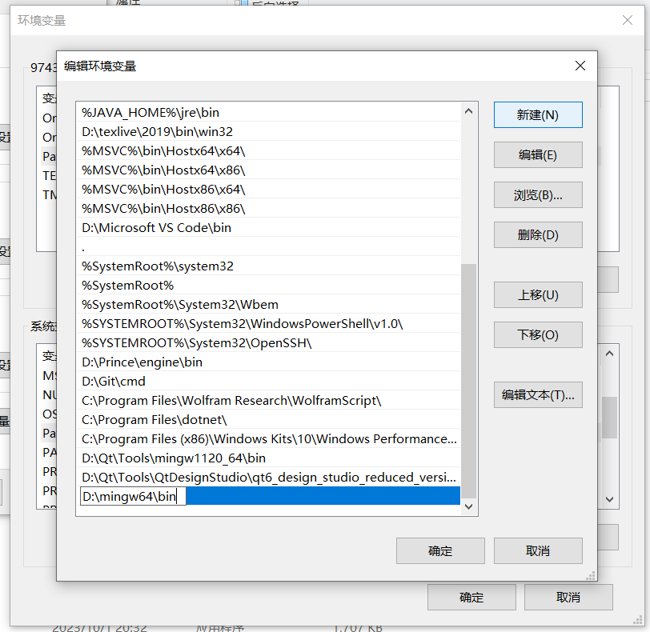

确定加进去后，进入命令提示符，输入 `g++` 并回车，此时系统会根据环境变量直接调用 `g++.exe`，  
你应该会看到以下输出：

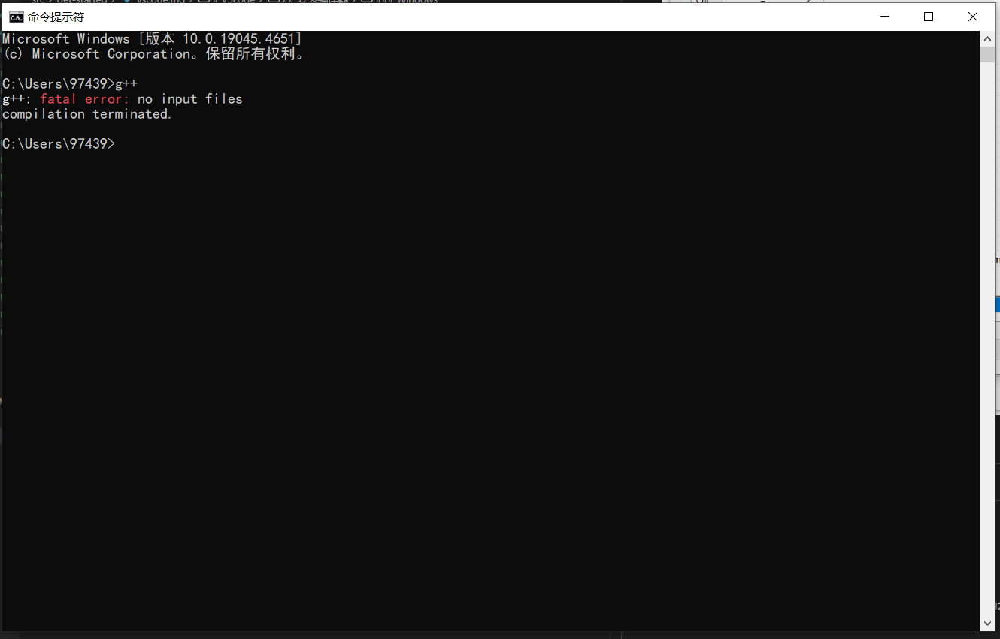

这表示编译器和环境变量配置成功。

## 尝试用 VScode 编写 C++ 程序

现在是时候尝试用 VScode 编写 C++ 程序了。新建 `a.cpp` 并打开，输入以下代码：

```cpp
#include<iostream>
using namespace std;
int main(){
	cout<<"Hello World!"<<endl;
	return 0;
}
```

在右上角选择 “运行 C/C++ 文件”，再在弹出的页面选择你配置好的编译器：


第一次运行会先跳到终端然后跳到调试控制台，我们转回终端，就能看到程序的输出：


----------------------------------------------

**Github链接与使用**

-----

**数学建模相关**

**b站：**[数学建模老哥](https://space.bilibili.com/400575790?spm_id_from=333.337.0.0)

**b站：**[清风数学建模](https://www.bilibili.com/video/BV1DW411s7wi/?spm_id_from=333.337.search-card.all.click)

以上两个是b站名气最高的数学建模讲解，如有需要软件，这些视频简介中都有获取方式
