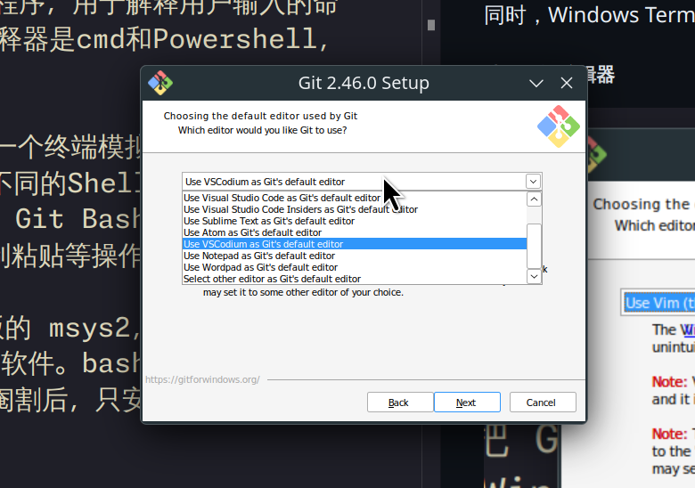
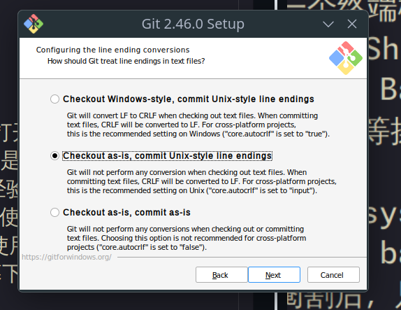
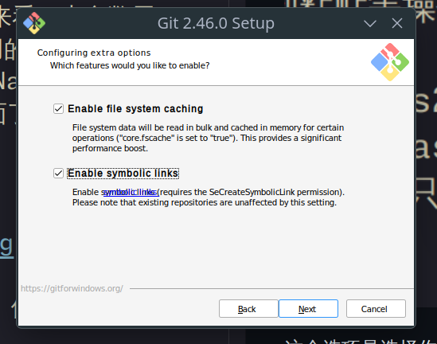

# 安装 Git

前文提到，Git`可以在任何操作系统上运行`。那么，本文将讲解在 Windows, Linux，以及 macOS 上如何安装 Git。

安装的部分大家跳转到适合自己操作系统的部分即可。

## Windows

Windows 下安装Git稍微麻烦一些，因为Git本身是一个**命令行**工具，而Windows下的用户对命令行的使用并不是很熟悉，同时Windows下的命令行工具也跟垃圾一样难用。不过如果你会一点点命令行，并且有使用包管理器，你可以跳转到使用包管理器安装的部分。其他人就别看了，直接去**手动安装**部分吧。

需要说明的是，使用包管理器和手动安装，都是使用相同的软件来源，只是安装方式不同。因此效果是一样的。

### 使用包管理器

如果你有使用 winget 包管理器，那么安装 Git 就像和在 Linux 下安装软件一样简单。Windows下有很多种包管理器，下面介绍两种最常见的包管理器winget 和 scoop上安装Git。

#### 使用 winget

使用以下命令安装 Git：
```bash
winget install --id Git.Git -e --source winget
```

#### 使用 scoop

使用以下命令安装 Git：
```bash
scoop install git
```

### 手动安装

前往[Git for Windows官网](https://git-scm.com/download/windows)。你应该会看到和下图类似的页面：


现在，你需要根据你的机器选择合适的架构[^1]。对于大多数电脑用户来说，尤其是对于 Windows 10及以上的用户，选择`64-bit`即可。这些操作系统都是64位的。只要你的电脑不是十几年前的，一般都是64位的。

不过，即使你不知道自己的电脑是什么架构，也不用担心。Git官网自动帮你检测了你的电脑架构，你只需要点击巨大的`Download for Windows`标题下的**Click here to download**超链接即可。

[^1]: 不同的架构使用不同的CPU指令集，因此选择错误的架构会导致Git无法运行。

下载完成后，双击下载的安装包，打开安装文件，**你需要在下面几个页面注意一下选项**，其他地方一路`Next`即可。一定要先看完再安装，不然后悔莫及。

我的图片是在Linux下使用Wine打开的，所以某些字体可能会有点问题，但是不影响理解。

##### 添加 Git Bash 到 Windows Terminal


勾选倒数第二个选项`(New) Add a Git Bash Profile to Windows Terminal`。前面说过，Git 是一个**命令行**工具，而 Git Bash 是一个包含了Git的shell。这个选项会把 Git Bash 添加到 Windows Terminal 中，这样你就可以直接在 Windows Terminal 中使用 Git Bash 了。

Shell[^2] 是一个命令行解释器，它是一个程序，用于解释用户输入的命令，并执行这些命令。Windows下的命令行解释器是cmd和Powershell，而Git Bash是一个基于bash的Shell。

我们使用 Windows Terminal 是因为它是一个终端模拟器，可以同时打开多个终端，而且可以在一个窗口中同时打开不同的Shell。这样，你就可以在一个窗口中同时使用cmd，Powershell，Git Bash等Shell了。同时，Windows Terminal也能更好地支持复制粘贴等操作。

[^2]: 更准确地说，Git Bash是一个阉割版的 msys2，msys2和cygwin都是在Windows上提供类Unix环境的软件。bash是Unix上最常用的Shell之一。所以，Git Bash就是一个阉割后，只安装了Git和bash的msys2。

##### 选择默认编辑器



这个选项是选择你的默认编辑器。Git 会在一些情况下打开一个编辑器。大多数 Unix 用户都使用Vim/Neovim作为编辑器。但是，如果你不会/根本不知道Vim，请**千万不要**使用Vim。根据我的经验来看，大多数用户进入Vim后都不知道怎么退出。所以，请选择你在外部使用的编辑器，比如VS Code。如果没有，建议安装一个。实在不写可以使用Nano，这也是一个命令行的编辑器，但是它的操作都傻瓜式地写在屏幕下面了。

##### 选择默认换行符



你可能听说过 Unix 系统使用`\n`作为换行符，Windows 使用`\r\n`作为换行符。这个选项就是选择你的默认换行符。请**一定**`Checkout as-is, commit Unix-style line endings`即可。这个选项会在你检出代码时，使用Unix风格的换行符，提交代码时，使用Unix风格的换行符。否则，你在提交代码的时候很可能产生一大堆更改，因为换行符不同。

##### 启用软链接


把第二个选项`Enable symbolic links`勾选上。

软链接是一种特殊的文件，它指向另一个文件。软链接在Windows下叫做快捷方式。软链接在Unix下有两种，一种是符号链接，另一种是硬链接。符号链接是一种特殊的文件，它指向另一个文件。硬链接是一个文件的另一个名字。软链接在Windows下叫做快捷方式。这个选项是启用符号链接，这样你就可以在Git中使用软链接了。后面我们会稍微提到软链接，现在你你不许要知道这是什么。

接下来你就可以一路`Next`了。

安装完成后，在任意文件夹中按住`shift`，右键点击鼠标，你会看到`在此处打开 Git Bash`或者`Open Git Bash here`。点击这个选项，你就可以**在当前文件夹**中打开 Git Bash 了。


你也可以使用Windows Terminal，请先按照以下视频添加Git Bash的配置。

<video src="./assets/add-profile.mp4" controls="controls"></video>

## Linux

跳转到你的发行版的部分，按照你的发行版安装即可。

### Arch Linux

```bash
sudo pacman -S git
```

### Debian/Ubuntu

```bash
sudo apt install git
```

### Fedora

```bash
sudo dnf install git
```

### openSUSE

```bash
sudo zypper install git
```

### Gentoo

自己编译去吧。

## macOS

macOS 是基于 Unix 的操作系统，因此安装 Git 就像在 Linux 下安装软件一样简单。不过macOS不自带有包管理器，因此你需要自己安装一个包管理器。这里推荐使用 Homebrew。

### 使用 Homebrew

```bash
brew install git
```

# 结束

安装完成后，你可以打开终端，输入`git --version`，然后回车，看到类似以下输出，说明安装成功：

```bash
caiyi@archlinux ~> git --version
git version 2.45.2
```

下一讲，我们将讲解如何配置 Git，以及简要介绍命令行和shell的基本操作。